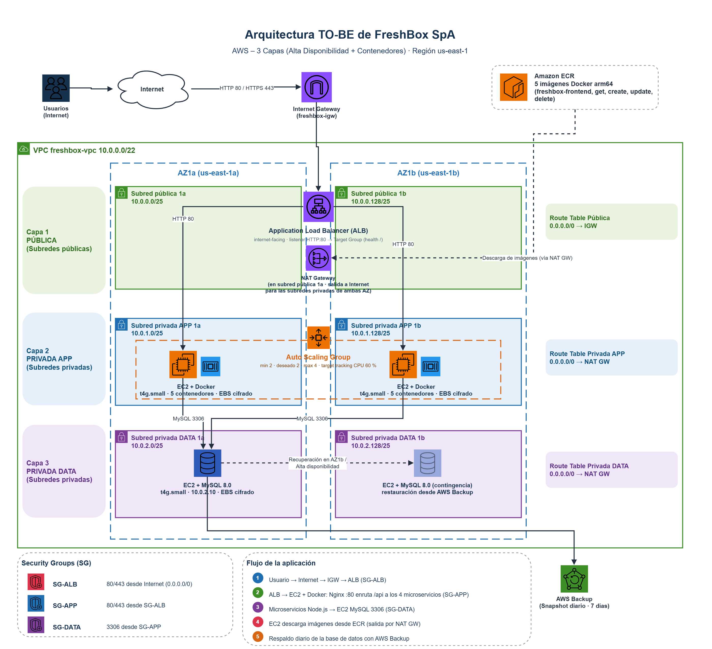

# EV1 — EP1 ARY1102 · FreshBox SpA

Arquitectura TO-BE de tres capas en AWS (Academy Learner Lab) para el catálogo online de FreshBox: VPC `10.0.0.0/22` con seis subredes `/25` en dos AZ, ALB, Auto Scaling Group (2–4 EC2 `t4g.small` con Docker: frontend Nginx + 4 microservicios), EC2 MySQL con AWS Backup y Security Groups por capa. Infraestructura con Terraform, desplegada desde GitHub Actions **sin push** (Actions → Run workflow).

## Diagrama TO-BE

[](diagramas/D1_FreshBox_TOBE.png)

Editable en [`diagramas/D1_FreshBox_TOBE.drawio`](diagramas/D1_FreshBox_TOBE.drawio) (draw.io) y publicado también en [Eraser.io](https://app.eraser.io/workspace/gSCDj5OUcicVftci9FlG?diagram=QsxnEutyEokrQdSwhicx&layout=canvas).

```
.gitattributes                     finales de línea LF en todo el repo: los .sh y .tpl corren en Linux (ver README raíz)
.github/workflows/                 (raíz del repo; GitHub solo los lee ahí)
├── ep1-deploy.yaml                EP1 · Desplegar FreshBox (infra + app)   ← Run workflow
├── ep1-provision-freshbox.yaml    EP1 · Infraestructura: backend de estado → apply | destroy | plan (reutilizable + Run workflow)
├── ep1-bootstrap-tfstate.yaml     EP1 · Backend de estado: bucket S3 + tabla DynamoDB si no existen (reutilizable + Run workflow)
├── ep1-deploy-app-ecr.yaml        plantilla: build arm64 → ECR → rolling de EC2 App → smoke test
└── ep1-validate.yaml              CI: terraform validate + docker build sin publicar
EV1/
├── infra/freshbox-ep1/            Terraform (main.tf, variables.tf, outputs.tf, templates/, files/)
├── app/                           frontend Nginx + 4 microservicios Node + init.sql + compose
├── script/bootstrap-tfstate.sh    crea el bucket S3 del estado y la tabla DynamoDB de bloqueo si no existen (tras un reset del lab)
└── diagramas/                     D1 TO-BE (draw.io + PNG; enlace a Eraser en su README)
```

## Flujo de despliegue

```
Run workflow "EP1 · Desplegar" ──► backend de estado (S3 + DynamoDB) ──► infra (terraform apply) ──► app (5× build arm64 → ECR) ──► rolling de EC2 App + curl al ALB
```

Las plantillas se invocan con `uses: ./.github/workflows/...` (mismo repo). `ep1-provision-freshbox.yaml` también tiene su propio *Run workflow* para levantar, bajar (`destroy`) o revisar (`plan`) solo la infraestructura; en cualquiera de los tres casos su primer job es `ep1-bootstrap-tfstate.yaml`, que deja listos el bucket de estado y la tabla de bloqueo antes de `terraform init`. Ese workflow también se puede lanzar solo (*EP1 · Backend de estado*) para preparar el backend antes de levantar nada.

## Cada sesión del Learner Lab

Las credenciales del lab duran una sesión (~4 h) y no admiten OIDC (no se pueden crear roles IAM); por eso van como secretos del repo (`AWS_ACCESS_KEY_ID`, `AWS_SECRET_ACCESS_KEY`, `AWS_SESSION_TOKEN`) y se renuevan en cada sesión:

1. Iniciar el lab → **AWS Details → AWS CLI: Show**: ahí están los tres valores.
2. GitHub → **Settings → Secrets and variables → Actions** → actualizar los tres secretos con esos valores.
3. Actions → **EP1 · Desplegar FreshBox (infra + app)** → Run workflow: backend de estado → infra → app en un solo run. El resumen final muestra la URL del ALB.
4. Al terminar: Actions → **EP1 · Infraestructura** → `destroy`. Todo desaparece y no consume créditos; solo quedan el bucket de estado (`freshbox-tfstate-870431978422`) y la tabla de bloqueo (`freshbox-tfstate-lock`), vacíos y sin costo. Si un *reset* del lab los borra, el job *backend de estado* los vuelve a crear antes del siguiente `init` (`script/bootstrap-tfstate.sh`; ver `infra/freshbox-ep1/README.md`).

Si un job falla con `ExpiredToken`, repetir el paso 2 y relanzar. En el PC, el mismo bloque va en `~/.aws/credentials`.

## Equivalente en local

```bash
./EV1/script/bootstrap-tfstate.sh                           # crea bucket de estado y tabla de bloqueo si no existen
terraform -chdir=EV1/infra/freshbox-ep1 apply
cd EV1/app && ./scripts/ecr-push.sh && cd ../..
aws ec2 terminate-instances --instance-ids <id-ec2-app>   # de a una; el ASG la reemplaza (StartInstanceRefresh esta bloqueado en el lab)
terraform -chdir=EV1/infra/freshbox-ep1 output alb_url
```

Validación: `curl http://<alb-dns>/api/products`; en una EC2 App (Session Manager) `docker ps` lista los 5 contenedores; en la EC2 MySQL `docker exec -it freshbox-db mysql -u alumno -palumno123 freshbox -e "SELECT id,nombre FROM productos;"`.
